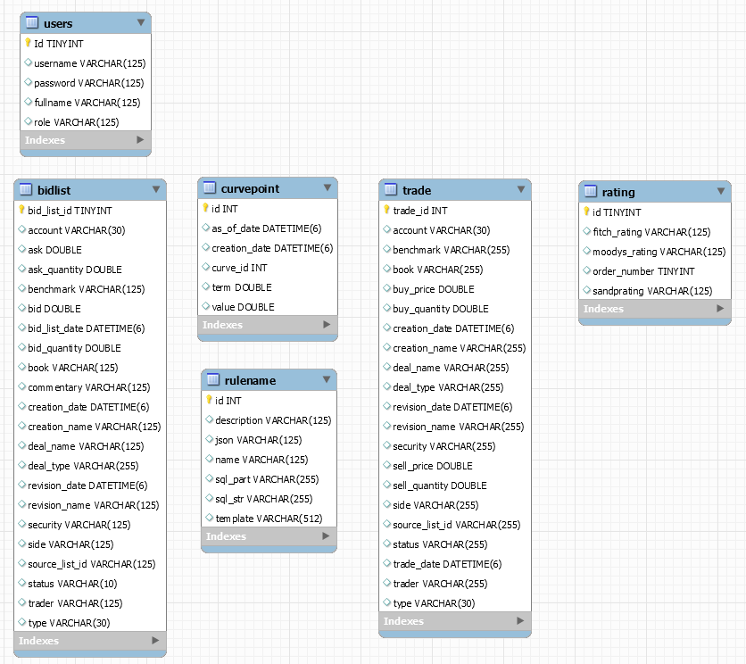

# Poseiden App
Poseiden is a financial and trading web-app with this features : 
- BidLists
- CurvePoints
- Rules
- Ratings
- Trades

This features are accessible for every connected User.

It possible to add User with profil "Admin" or "User"

## Database UML

## Prerequisites

What things you need to install the software and how to install them

- Java 1.8
- Maven 3.6.2
- Thymeleaf
- Mysql 8.0.17 : need to create a MySQL database "demo" on localhost.

## Installing
Run the sql commands data.sql or use hibernate (spring.jpa.hibernate.ddl-auto=update in the application.properties file)

Create a variable system JASYPT_ENCRYPTOR_PASSWORD that contains the private key to encrypt the password. The encrypted password is to change in the file application.properties (spring.datasource.password)

## Running App

mvn clean install
mvn clean verify (generate tests and test report)
mvn site (generate reportings)

or to launch the application with Maven :
mvn spring-boot:run (run the application)

## Documentation
Read the JavaDoc

## Actuator 

http://localhost:8080/actuator
	/health
	/httptrace
	/metrics

## Testing
The app has unit tests and integration tests written. To run the test with maven execute the command mvn test in the folder with the pom.xml file.

